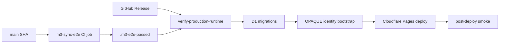

# M3 Deployment Runbook

Operator checklist for the M3 server-side stack: SvelteKit API routes
inside the Cloudflare Pages Worker, D1 OPAQUE state, R2 ciphertext
blobs, signed releases, and the CI artifact gate that proves the sync
path before production deploy.

## Production Flow



## One-Time Cloudflare Setup

Create production resources and wire the IDs/names in
[wrangler.toml](../wrangler.toml):

```bash
wrangler d1 create vuvault-auth-production
wrangler r2 bucket create vuvault-blobs-production
```

Configure the Pages dashboard rate-limit bindings under:

```text
Cloudflare Pages > vuvault > Settings > Functions > Rate Limiting
```

Required bindings:

- `OPAQUE_REGISTER_LIMITER`: 10 req / 60 s, key = client IP.
- `OPAQUE_LOGIN_LIMITER`: 30 req / 60 s, key = client IP.
- `BLOB_LIMITER`: 30 req / 60 s, key = account ID.

Production sets `OPAQUE_RATE_LIMIT_MODE="fail-closed"`, so missing or
failing bindings make the protected API endpoints return 503 instead of
silently accepting unlimited traffic.

## Release Preconditions

Before publishing a GitHub Release for a SHA:

```bash
npm run check
npm run lint
npm run test
npm run test:e2e
```

CI must also pass `m3-sync-e2e`. That job builds the Cloudflare bundle,
applies local D1 migrations, seeds a local OPAQUE identity with
[scripts/seed-opaque-identity.mjs](../scripts/seed-opaque-identity.mjs),
starts Wrangler Pages with real local D1/R2 bindings, runs
[tests/e2e/sync.spec.ts](../tests/e2e/sync.spec.ts), and uploads
`.m3-e2e-passed` with the commit SHA. The release workflow downloads
that artifact by name and refuses to deploy if it is missing or was
produced for a different SHA.

## Cut a Release

```bash
git checkout main
git pull
gh release create v0.2.0 --title "VuVault 0.2.0" --generate-notes
```

The release workflow:

1. Builds twice and verifies `.bundle-digest` convergence.
2. Downloads `.m3-e2e-passed` for the release SHA.
3. Runs [scripts/verify-production-runtime.mjs](../scripts/verify-production-runtime.mjs), which rejects placeholder hashes, empty or non-HTTPS `PUBLIC_SYNC_ORIGIN`, demo/test auth flags, and missing or mismatched M3 artifacts.
4. Signs `.bundle-digest` with keyless Sigstore/cosign and attaches release artifacts.
5. Applies D1 migrations to `AUTH_DB --env production --remote`.
6. Runs `node scripts/seed-opaque-identity.mjs --env=production --rotate=false`.
7. Deploys the Cloudflare Pages bundle.
8. Smokes `/api/capabilities`, asserts the deleted legacy transport (`/api/blobs/*`, `/api/documents/*`) now returns 404/410/501 (route removed), and that unauthenticated `/api/v2/blobs/<uuid>` returns 401.

## OPAQUE Identity Operations

First deploy and normal redeploys use:

```bash
node scripts/seed-opaque-identity.mjs --env=production --rotate=false
```

This is idempotent: it inserts a random 32-byte seed only if
`server_identity` is empty.

Emergency rotation is destructive and requires an explicit env var:

```bash
ALLOW_OPAQUE_ROTATION=true \
  node scripts/seed-opaque-identity.mjs --env=production --rotate=true
```

Rotation invalidates every existing OPAQUE registration. Users must
re-enroll because the server cannot finish login transcripts generated
for the old identity.

## Local M3 E2E

To reproduce CI locally:

```bash
npm run build
npx wrangler d1 migrations apply AUTH_DB --local
node scripts/seed-opaque-identity.mjs --env=local --rotate=true
npx wrangler pages dev .svelte-kit/cloudflare --port 8788
PUBLIC_SYNC_ORIGIN=http://localhost:8788 PUBLIC_M3_E2E_AUTH=true npx vite preview --port 5173
PLAYWRIGHT_SKIP_WEB_SERVER=1 M3_E2E=1 npx playwright test tests/e2e/sync.spec.ts
```

`PUBLIC_M3_E2E_AUTH` is a CI-only WebAuthn PRF shim. Production
preflight rejects it.

## Rollback

Cloudflare Pages keeps every deployment:

```bash
wrangler pages deployment list --project-name=vuvault
wrangler pages deployment rollback <previous-id>
```

D1 migrations are forward-only. A rollback must tolerate extra columns
or tables, or ship a forward fix. Do not rotate OPAQUE identity as part
of rollback unless account re-enrollment is explicitly accepted.

## Operational Invariants

1. `PUBLIC_BUNDLE_HASH` must equal the signed manifest aggregate.
2. The OPAQUE server stores only protocol records, never plaintext or
   password-equivalent material.
3. Production API rate-limit bindings fail closed.
4. Blob sync requires a short-lived KE3 bearer token and stores only
   encrypted vault fragments in R2.
5. Release deploys require a same-SHA real D1/R2 E2E artifact and a
   post-deploy API smoke check.
