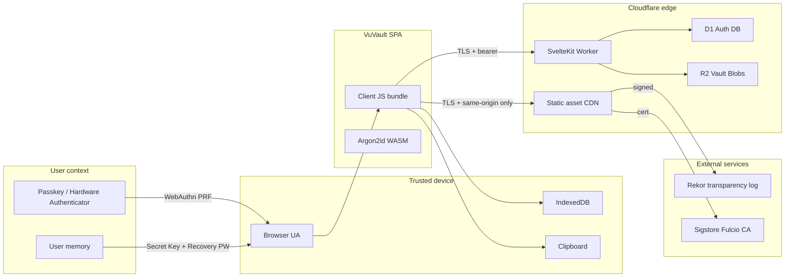
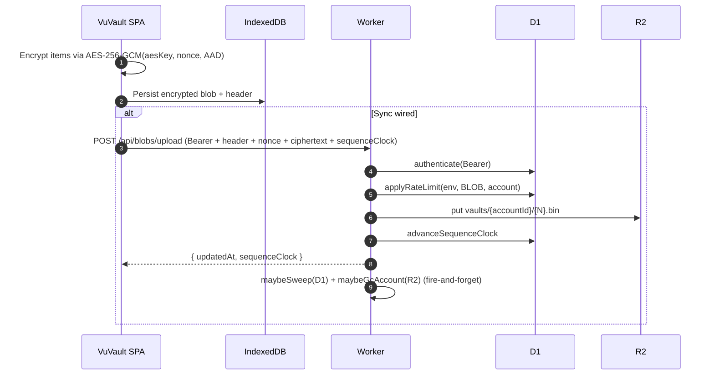

# VuVault Threat Model

**Version:** 1.0
**Status:** Tier 1 production-launch candidate
**Companion:** [`docs/SECURITY.md`](./SECURITY.md), [`docs/ARCHITECTURE.md`](./ARCHITECTURE.md), [`docs/PRIVACY-LEVEL.md`](./PRIVACY-LEVEL.md)

This document is the formal threat model for VuVault. It enumerates the assets the system protects, the trust boundaries those assets cross, the threats applicable at each boundary, and the controls that mitigate them. It is the auditor-facing companion to the prose-style security narrative in `docs/SECURITY.md`; both must remain consistent.

---

## 1. Foundational claim

> **The server is mathematically incapable of accessing user data.**

Every threat in this document is evaluated against that invariant. A threat that lets the server, a coerced operator, an Anthropic-style AI agent, a court order, or a hostile network operator read user data is a P0; threats that bypass operational guarantees (rate limiting, availability) are P1; threats that only affect a single endpoint are P2.

---

## 2. Asset inventory

Assets are ranked by the impact a successful compromise would have on the foundational claim.

| ID | Asset | Storage location | Sensitivity | Primary control |
| --- | --- | --- | --- | --- |
| A01 | Vault key (per-vault AES-256 key) | In-memory only, wrapped on disk under the v2 hybrid envelope | **Critical** | Never leaves the device; derived from PRF + Secret Key + (optional) MP key via HKDF-SHA512 |
| A02 | Per-vault hybrid envelope private keys (X25519 + ML-KEM-1024) | Deterministically derived per request from A01; never persisted | **Critical** | Deterministic derivation in [`vault-envelope.ts`](../src/lib/services/vault-envelope.ts); ML-KEM 1024 from `@noble/post-quantum@0.4.1` |
| A03 | WebAuthn passkey PRF output | Hardware enclave (Touch ID / Secure Enclave / TPM) | **Critical** | Never visible to JS except as ephemeral 32-byte derived secret; cleared on lock |
| A04 | Secret Key (per-device random) | IndexedDB, base32-encoded, also exported in Emergency Kit | **Critical** | Re-bound to WebAuthn PRF; cannot be used alone for unlock |
| A05 | Master Password (optional 3rd factor) | Never persisted by the application | **Critical** | Argon2id (RFC 9106) with `VAULT_HIGH_PARAMS` (256 MiB / 4 passes / p=1) before HKDF mix-in |
| A06 | Recovery Password (separate offline factor) | Never persisted by the application | **High** | Argon2id under the same preset; policy-checked at creation (≥ 16 chars, ~80-bit target) |
| A07 | Local Recovery Envelope (.vukey + IndexedDB row) | IndexedDB; user-exported file | **High** | Sealed under Argon2id(Recovery Password) ⨁ Secret Key, AES-GCM with context-bound AAD |
| A08 | Vault items (decrypted, in-memory) | Svelte 5 runes store, post-unlock | **Critical** | Zeroized on lock; auto-lock 5min idle / 30s hidden / pagehide / freeze |
| A09 | Vault blob ciphertext + AAD | IndexedDB (always) + R2 (when sync wired) | Low (opaque) | Server stores ciphertext only; AAD binds formatVersion + auth-mode + deviceSalt + credId digest + header digest |
| A10 | Document blob ciphertext | IndexedDB + R2 | Low (opaque) | Same AES-256-GCM with `vuvault-doc-aad-v1` domain bound to document UUID |
| A11 | OPAQUE envelope (server-stored) | D1 `accounts.envelope_bytes` | Low (opaque) | RFC 9807 — server holds opaque envelope, NOT password equivalent |
| A12 | OPAQUE server identity (long-lived) | D1 `server_identity.oprf_seed` | **High** | 32-byte random seeded once at deploy; all-zero rejected; rotating invalidates every registration |
| A13 | OPAQUE session bearer token (1h TTL) | D1 `sessions.token` + client `sessionStorage` | Medium | Revoked server-side on lock via `POST /api/opaque/logout`; revalidated on every blob op |
| A14 | Bundle hash (SHA-384) | Compiled into bundle; published to Rekor | Public | Verified at every unlock; mismatch refuses decryption |
| A15 | Audit feed (in-memory) | Vault store on unlock | Low | Bounded ring buffer; no plaintext item content; safeAuditLabel redactor |

---

## 3. Trust boundaries



| ID | Boundary | Direction | Crossed by | Trust assumption |
| --- | --- | --- | --- | --- |
| B01 | User context ⟷ Trusted device | Bidirectional | Passkey biometric, Secret Key entry, Master/Recovery Password entry | Device is not currently compromised by endpoint malware (out of scope per `SECURITY.md` B1) |
| B02 | Trusted device ⟷ VuVault SPA | Bidirectional | Browser-managed memory, IndexedDB, clipboard | Browser provides a constant-time WebCrypto implementation (out of scope per `SECURITY.md` B3) |
| B03 | VuVault SPA ⟷ Cloudflare edge | Bidirectional | TLS 1.3 + same-origin fetch | TLS endpoint is the deployed origin; SRI + reproducible builds + Rekor close the supply-chain loop |
| B04 | Worker ⟷ D1 / R2 | Bidirectional | Cloudflare bindings | Cloudflare honors binding contracts; D1 errors trigger fail-closed limiter in production |
| B05 | Cloudflare edge ⟷ External (Rekor / Sigstore) | Out only (build-time) | OIDC + cosign keyless | Rekor entries are append-only and globally observable |

---

## 4. Data-flow diagrams

### 4.1 Unlock flow (Tier 1)

```mermaid
sequenceDiagram
	autonumber
	participant U as User
	participant UA as Browser UA
	participant SPA as VuVault SPA
	participant IDB as IndexedDB
	participant W as Worker
	participant D1 as D1 (AUTH_DB)
	participant R2 as R2 (VAULT_BLOBS)

	U->>UA: Tap Unlock
	UA->>U: WebAuthn assertion request
	U-->>UA: Biometric / passkey
	UA-->>SPA: PRF output (32 bytes)
	SPA->>IDB: Read account, vault row, recovery envelope
	SPA->>SPA: Derive vault key via HKDF
	SPA->>IDB: Decrypt vault blob (AES-GCM, AAD-bound)
	alt Sync wired
		SPA->>W: POST /api/opaque/login/ke1
		W->>D1: SELECT account + load identity
		W-->>SPA: KE2
		SPA->>W: POST /api/opaque/login/ke3
		W->>D1: INSERT session, UPDATE last_login_at
		W-->>SPA: token + expiresAt + sequenceClock
		SPA->>W: GET /api/blobs/latest (Bearer)
		W->>R2: list + get latest
		W-->>SPA: ciphertext + sequenceClock
		SPA->>SPA: Compare server clock; promote if higher
	end
	SPA->>SPA: Verify bundle integrity (SHA-384)
	SPA-->>U: Vault ready
```

**Threats by step (selected):**

| Step | Threat | Mitigation |
| --- | --- | --- |
| 4 | PRF replay against an offline copy of IndexedDB | Secret Key + PRF + device salt are all required; missing any one fails decrypt |
| 6 | Tampered vault blob | AAD binds formatVersion + auth-mode + deviceSalt + credId digest + header digest; GCM tag fails on any tamper |
| 9–13 | Server brute-force against password | OPAQUE — server never sees the password; OPRF blinds it before transit |
| 14 | Token theft | 1h TTL; revoked on lock via logout endpoint; bearer required for every blob op |
| 17 | Replay of older blob | Server enforces monotonic sequence clock; client checks server clock ≥ local |
| 18 | Backdoored bundle | SHA-384 verified in-browser against `.bundle-digest` baked at build; mismatch refuses decryption |

### 4.2 Save / sync flow



**Threats by step (selected):**

| Step | Threat | Mitigation |
| --- | --- | --- |
| 1 | AAD substitution between accounts | AAD binds deviceSalt + credId digest; cross-account replay fails decrypt |
| 4 | Stolen bearer token | Token validated against D1 + expiry on every op; logout invalidates immediately |
| 5 | Quota-flood DoS | D1-backed sliding window; production fail-closed on D1 outage; 30 req/60s per account |
| 7 | Replay older blob | Monotonic sequence clock enforced in `advanceSequenceClock`; 409 on regression |
| 9 | Unbounded R2 growth | Opportunistic GC purges superseded vault blobs (`{N}.bin` ≤ clock - KEEP_SUPERSEDED) and dormant document blobs |

---

## 5. STRIDE per trust boundary

| Boundary | Spoofing | Tampering | Repudiation | Information disclosure | Denial of service | Elevation of privilege |
| --- | --- | --- | --- | --- | --- | --- |
| **B01** User ⟷ Device | Out of scope (rubber-hose); decoy vaults planned Tier 3 | Out of scope (endpoint malware) | Auto-lock + audit feed | Auto-clear clipboard 60s, auto-hide reveals 30s | Lock on idle / hidden / pagehide | Endpoint compromise is out of scope |
| **B02** Device ⟷ SPA | WebAuthn assertion ties session to passkey | Reproducible builds + bundle hash check refuses tampered JS | Audit feed records every state change | IndexedDB rows are ciphertext + AAD; refuses any plaintext substring leak (full-workflow E2E asserts) | Lock + zeroize on Svelte 5 store teardown | Strict CSP, no eval, Trusted Types target (deferred until WASM tested) |
| **B03** SPA ⟷ Edge | OPAQUE prevents server impersonation post-registration | TLS 1.3 + HSTS preload; SRI on critical resources | Server logs cf-connecting-ip + accountId | Server stores OPAQUE envelope + ciphertext only — no password equivalent | Rate limits (10/30/30 per 60s for register/login/blob) | Bearer tokens scoped to accountId; cross-account blob access not possible |
| **B04** Worker ⟷ D1/R2 | Bindings are static; cannot be redirected at runtime | Both stores write opaque bytes; AES-GCM tag protects integrity | D1 writes recoverable from request logs | D1 sees client_id (not user-provided email); R2 sees opaque blobs | Fail-closed limiter on D1 outage; opportunistic GC bounds R2 growth | OPAQUE_SERVER_ID pinned per env so preview transcripts cannot replay |
| **B05** Edge ⟷ External | Sigstore keyless OIDC + Rekor transparency | Rekor entries are tamper-evident | Rekor is globally observable | No user data crosses this boundary | N/A — build-time only | N/A |

---

## 6. Adversary catalog

| ID | Adversary | Capability | Defense (current Tier 1) |
| --- | --- | --- | --- |
| **A1** | Passive network observer | Read TLS-protected traffic | TLS 1.3 + HSTS + OPAQUE; server never sees password |
| **A2** | Active network MITM | Intercept + modify | Same-origin only; SRI-equivalent via reproducible builds; CSP `default-src 'self'` |
| **A3** | Compromised server (single instance) | Read every D1 row + R2 object | Client-side AES-256-GCM under hybrid envelope; server sees ciphertext only |
| **A4** | Coerced server operator (NSL, court order, hostile employee) | Same as A3 | Mathematical incapability — server has no keys; ciphertext is deliberately useless |
| **A5** | Malicious build / supply-chain attacker | Inject backdoor in shipped bundle | Reproducible build (two-pass digest); Sigstore + Rekor; bundle hash verified on every unlock |
| **A6** | Harvest-now-decrypt-later quantum adversary | Store ciphertext today; decrypt with future quantum hardware | Hybrid X25519 + ML-KEM-1024 envelope; vault stolen today remains undecryptable post-Q-day |
| **A7** | Phishing of master password | Trick user into typing password into attacker page | OPAQUE — password never crosses TLS in any form; WebAuthn PRF is the actual unlock factor |
| **A8** | Stolen Secret Key alone | Exfil one factor | Requires WebAuthn PRF from same device; Secret Key alone unlocks nothing |
| **A9** | Stolen `.vukey` Recovery Envelope alone | Exfil one factor | Argon2id-sealed under separate Recovery Password; even with Secret Key, brute force at Argon2id cost is the only path |
| **A10** | DoS via API flooding | Burst legit-looking traffic | D1 sliding-window limits; production fail-closed; release workflow validates with 12-burst probe |
| **A11** | Token theft (lateral movement after unlock) | Sniff bearer token | 1h TTL backstop; explicit `POST /api/opaque/logout` revokes server-side on lock |
| **A12** | Cross-account blob access | Try to read another account's blob | Bearer token resolves to one accountId; R2 keys are namespaced by accountId; sequence-clock comparison cross-account |
| **A13** | OPAQUE server-identity rotation attack | Force a server rotation to invalidate active sessions | All-zero seed rejected; rotation requires DB seed change which invalidates every registration — fail-loud not fail-silent |

---

## 7. Out-of-scope threats

These are documented in [`docs/SECURITY.md`](./SECURITY.md) and reproduced here so auditors do not chase them as gaps.

| ID | Threat | Why out of scope | Roadmap response |
| --- | --- | --- | --- |
| **B1** | Endpoint compromise (device malware) | JavaScript cannot defeat persistent endpoint compromise | Aggressive zeroize on lock; auto-lock heuristics |
| **B2** | Coercion of the user | Crypto does not solve consent | Plausible-deniability decoy vaults — Tier 3 |
| **B3** | Side-channels in browser WebCrypto | Browser-vendor problem; we use only constant-time Noble primitives where we control the implementation | Reported upstream |
| **B4** | Implementation bugs in our own code | Defended by audits + fuzzing, not architecture | Third-party Tier 1 audit — M4 |
| **B5** | Sophisticated nation-state targeting (TPM + firmware + browser update channel) | Outside our threat envelope | None — explicit |
| **B6** | Account-existence oracle from OPAQUE | Unavoidable from RFC 9807 | Explicit in `SECURITY.md` §scope |
| **B7** | Total sync volume / upload cadence side channel | Inherent to operating a sync server | Out of ZK scope; explicit |
| **B8** | Offline guessing of weak Recovery Password | Argon2id slows it but doesn't prevent it | Policy enforcement (≥ 16 chars, ~80-bit target) + explicit UX warning |
| **B9** | Document-blob size / timing observability | Ciphertext is sealed at natural length; no bucketed padding yet | Tier 2 (L07) — encrypted CRDT sync with padding |
| **B10** | MLS / shared vault threat surface | Sharing is not yet shipped | Tier 2 (L06) |

---

## 8. Risk rating matrix

Risks are computed as `Likelihood × Impact`. Likelihood is for the deployed system as of the current release; impact is on the foundational ZK claim.

| Risk | Likelihood | Impact | Composite | Notes |
| --- | --- | --- | --- | --- |
| Cross-tenant vault read via API misrouting | Very low | Catastrophic | **Medium** | Bearer + accountId namespace + integration test for blob ownership |
| OPAQUE_SERVER_ID drift between envs | Very low | Catastrophic | **Medium** | Explicit pin in `wrangler.toml`; integration test that mocks the pin |
| Backdoored bundle reaches user | Very low | Catastrophic | **Medium** | Reproducible build + Rekor transparency; in-browser SHA-384 check |
| Token theft via XSS | Low | High | **Medium** | Strict CSP + Trusted Types target + token stored in sessionStorage (cleared on tab close) |
| Stale R2 blobs leak metadata over time | Medium | Low | **Low** | Opportunistic GC bounds growth |
| D1 outage forces fail-closed lockout | Low | Medium (UX) | **Low** | Documented; preview/local use fail-open mode |
| ML-KEM-1024 break before 2030 | Very low | Critical | **Low** | Hybrid envelope means classical X25519 remains a fallback layer |
| Argon2id parameter drift across versions | Low | Medium | **Low** | Snapshot per-account; verified by KAT under `npm run test:fips` |

---

## 9. Controls inventory (current Tier 1)

| Control | Implementation | Verification |
| --- | --- | --- |
| Client-side AES-256-GCM under hybrid envelope | `src/lib/services/vault-envelope.ts`, `vault-session.ts` | `vault-envelope.test.ts`, `vault-session.test.ts`, `full-workflow.spec.ts` (IndexedDB plaintext leak probe) |
| RFC 9807 OPAQUE client + server | `src/lib/services/opaque-client.ts`, `src/lib/server/api/server-opaque.ts` | `opaque-client.test.ts`, `worker.spec.ts` |
| Argon2id RFC 9106 | `src/lib/crypto/argon2.ts` | `argon2.test.ts`, `argon2id-rfc9106.kat.test.ts` |
| ML-KEM-1024 FIPS 203 | `@noble/post-quantum@0.4.1` (pinned) | `ml-kem-1024.kat.test.ts`, `ml-kem-1024.acvp.kat.test.ts` |
| Bundle integrity (SHA-384) | `scripts/build-manifest.mjs`, `verifyBundleIntegrity()` | `env.test.ts`, `env.tamper.test.ts` |
| Reproducible builds | `scripts/verify-reproducible.mjs` | `.github/workflows/ci.yml` `reproducible-build` |
| Sigstore + Rekor signing | `.github/workflows/release.yml` | Rekor transparency log entries |
| D1-backed sliding-window rate limiter | `src/lib/server/api/rate-limit-d1.ts` | `rate-limit-d1.test.ts`, release-workflow 12-burst probe |
| OPAQUE session revocation | `src/routes/api/opaque/logout/+server.ts` | Fire-and-forget call wired from `lockSession()` in `vault-session.ts` |
| Opportunistic D1 cleanup | `src/lib/server/api/cleanup.ts` | `cleanup.test.ts` |
| Opportunistic R2 garbage collection | `src/lib/server/api/r2-gc.ts` | `r2-gc.test.ts` |
| Per-env OPAQUE serverIdentity | `wrangler.toml` `[vars]` + `[env.production.vars]` | `audit-bindings.mjs` |
| Auto-lock (idle / hidden / pagehide) | `src/lib/services/auto-lock.ts` | `auto-lock.test.ts` |
| Clipboard auto-clear | `src/lib/services/secure-clipboard.ts` | `secure-clipboard.test.ts` |

---

## 10. Open issues / next-version targets

These are tracked but not fixed in the current Tier 1 release. They are NOT P0 — none of them violate the foundational claim.

- **OPAQUE log-rotation policy.** D1 `last_login_at` is updated but never trimmed. Long-term we want a privacy-friendly retention policy.
- **Trusted Types enforcement.** Currently set as a target; cannot enable globally until Argon2id WASM and FOUC-prevention scripts are migrated.
- **CSP `report-to` endpoint.** No CSP violation telemetry today (consistent with the no-telemetry policy). Auditors may want to add one for the audit window only.
- **Padding for document blobs.** Tier 2 (L07) — bucketed padding to defeat the size oracle on R2.
- **Public threat-model PDF.** This file is the source; an audit firm produces the PDF.

---

## 11. Document maintenance

- **Update on every release that touches a control listed in §9.**
- **Re-run §8 risk ratings whenever a control changes.**
- **Audit firms cite this file by commit SHA — never the un-pinned `main` ref.**

The most recent revision is committed as part of the [post-v0.1.4 audit pass](./verifications/2026-05-19-milestone-audit.md).
