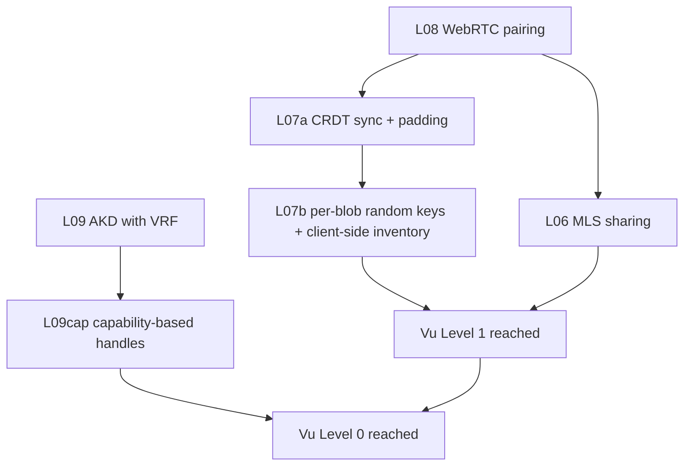

# Vu Level Migration Map

**Purpose.** Make the path from today's **Vu Level 2** to Tier 2's
**Vu Level 1** (and the longer path to **Vu Level 0**) mechanically
tractable. Each criterion below cites the exact code that holds the
project at Vu Level 2 today, the Tier-2 layer expected to close it,
and any gap in [`TIER2-ARCHITECTURE.md`](./TIER2-ARCHITECTURE.md)
that needs additional design work before implementation can start.

**Companion.** Level definitions live in
[`docs/PRIVACY-LEVEL.md`](./PRIVACY-LEVEL.md) §"Vu Privacy Levels
reference". The canonical taxonomy this audit is anchored on is in
[`PRIVACY_AUDIT.md`](../PRIVACY_AUDIT.md) §15. Today's per-route
metadata catalog is the
[`PRIVACY_AUDIT.md`](../PRIVACY_AUDIT.md) §8 "Metadata & Side
Channels" section.

---

## Direction of travel

```
Vu Level 5  →  Vu Level 4  →  Vu Level 3  →  Vu Level 2  →  Vu Level 1  →  Vu Level 0  →  SubZero
  banned        refused       refused      TODAY (M3)    Tier 2 (2027)   Tier 2+ + AKD  + audit + CSP
```

Lower number = stronger claim. The ladder cannot be skipped: moving
from Vu Level 2 to Vu Level 1 is **strictly subsumptive** — every
Vu Level 2 guarantee must continue to hold AND the additional
Vu-Level-1-only criteria must be added.

---

## Required deltas: Vu Level 2 → Vu Level 1

Vu Level 1 adds three things on top of Vu Level 2:

1. **No per-user blob inventories** — the server cannot enumerate
   how many blobs an account has, when they were written, or how
   their sizes evolved over time.
2. **No persistent device set** — the server cannot enumerate which
   devices belong to which account, nor produce a per-account
   `last_seen_at` log.
3. **No cross-account sequence-clock correlation** — the server
   cannot order events between accounts via a global counter.

The numeric IDs below match the criteria the data module documents
as the gap between Vu Level 2 and Vu Level 1. Each entry has:

- **Today (Vu Level 2):** the exact code/data that holds us here.
- **Tier-2 closer:** which layer of `TIER2-ARCHITECTURE.md` is
  responsible for closing it.
- **Spec status:** is the closure mechanism actually specified, or
  is the existing spec partial?
- **Verification:** what test or live probe will demonstrate the
  criterion is closed.

### V1-C1 · No per-user blob inventories

**Today (Vu Level 2):**
- R2 object keys leak both the account namespace and the blob
  count: `vaults/{accountId}/{N}.bin` for vault blobs
  ([`src/routes/api/blobs/upload/+server.ts`](../src/routes/api/blobs/upload/+server.ts) line 87)
  and `vaults/{accountId}/documents/{blobId}.bin` for document
  blobs ([`src/routes/api/documents/[blobId]/+server.ts`](../src/routes/api/documents/[blobId]/+server.ts) line 46).
- `/api/blobs/latest` walks the per-account prefix to list all
  objects under it ([`src/routes/api/blobs/latest/+server.ts`](../src/routes/api/blobs/latest/+server.ts) line 31).
- The opportunistic R2 garbage collector in
  [`src/lib/server/api/r2-gc.ts`](../src/lib/server/api/r2-gc.ts)
  uses the same prefix walk; correct given today's design, but
  it bakes the per-account inventory assumption into operations.

**Tier-2 closer:** [L07 — Encrypted CRDT sync](./TIER2-ARCHITECTURE.md#l07--encrypted-crdt-sync).
The spec moves storage from a single growing whole-vault blob to a
stream of ciphertext deltas at
`vaults/{accountId}/crdt/{updateIndex}.bin`. With bucketed padding,
**delta size** stops leaking item structure — but the **account
prefix and update index are still server-visible**.

**Spec status: PARTIAL.** [`TIER2-ARCHITECTURE.md` §L07 "Open issues"](./TIER2-ARCHITECTURE.md#l07--encrypted-crdt-sync)
lists padding profile and compaction policy. **It does not specify
how to eliminate the per-account inventory key prefix.** Two
candidate redesigns the spec needs to pick from:

- (a) **Per-blob random keys** (e.g., `blobs/{uuid}.bin`) with a
  client-side encrypted inventory pointer kept inside the vault
  itself. Server still sees one global namespace of blobs but
  cannot correlate which blob belongs to which account.
- (b) **PIR-style bucketed blob storage** — every account fetches
  the same N buckets per epoch; oblivious-RAM-flavored. Heavier,
  more expensive, more honest.

The audit recommendation in
[`PRIVACY_AUDIT.md`](../PRIVACY_AUDIT.md) F-003 (line 198) suggests
"unlinkable identifiers, blinded routing, and metadata
minimization." (a) is the minimum-viable form of that.

**Verification:**
- A live probe (extension of `release-probe-opaque.mjs`) that
  registers two accounts, uploads N blobs to each, and asserts the
  R2 namespace as observed from the API surface does NOT carry an
  account identifier in any key returned to a non-owning observer.
- An R2-side accounting query (run by an authorized auditor with
  Cloudflare API access) confirming that per-account prefix counts
  are not used by the upload/list paths.

### V1-C2 · No persistent device set

**Today (Vu Level 2):**
- D1 `device_pairings` table (created in
  [`migrations/0001_init.sql`](../migrations/0001_init.sql) line 97
  but not yet written to) is the documented future home for the
  device set.
- D1 `sessions.device_id` ([`migrations/0001_init.sql`](../migrations/0001_init.sql) line 81)
  is written on every OPAQUE login KE3
  ([`src/routes/api/opaque/login/ke3/+server.ts`](../src/routes/api/opaque/login/ke3/+server.ts) line 91).
- `last_login_at` is bumped per login on the account row
  ([`src/routes/api/opaque/login/ke3/+server.ts`](../src/routes/api/opaque/login/ke3/+server.ts) line 99).

Together those produce a server-visible "which devices logged in
when" log per account.

**Tier-2 closer:** [L08 — WebRTC + ECDH device pairing](./TIER2-ARCHITECTURE.md#l08--webrtc--ecdh-pairing).
The peer-to-peer pairing transcript avoids the server, but the
spec's own threat-model delta admits the gap explicitly:

> "Server learns device-set: **Same**; pairing itself is
> peer-to-peer but session minting still hits server."
> — [`TIER2-ARCHITECTURE.md` §L08 threat-model delta](./TIER2-ARCHITECTURE.md#l08--webrtc--ecdh-pairing)

**Spec status: PARTIAL.** L08 as specified does NOT close V1-C2.
The additional design needed:

- **Session-less sync.** Replace the bearer-token + D1 `sessions`
  row model with stateless, account-blinded capability tokens
  (e.g., HPKE-encrypted per-request capabilities derived from a
  group key shared with L06 MLS) so the server never persists a
  device_id ↔ account_id correlation.
- OR **per-session unlinkable session tokens** — rotate session
  tokens frequently, never tie them to a stable `device_id`, drop
  the `last_login_at` column. The server still observes "some
  device logged in" but cannot distinguish *this* device from a
  prior one.

**Verification:**
- A migration adds a CHECK constraint or removes the `device_id`
  column from `sessions`.
- An audit-bindings rule rejects future migrations that re-introduce
  device-correlating fields.
- A unit test for the chosen session-mint path asserts that two
  consecutive logins from the same client produce sessions with no
  shared identifier the server can correlate.

### V1-C3 · No cross-account sequence-clock correlation

**Today (Vu Level 2):**
- `accounts.sequence_clock`
  ([`migrations/0002_account_sequence_clock.sql`](../migrations/0002_account_sequence_clock.sql) line 6)
  is per-account today, which already prevents a *global* counter.
  But the upload-time ordering on R2 (object `uploaded` timestamps,
  inferred from `vaults/{accountId}/{N}.bin` index) and the
  per-session `sessions.sequence_clock` allow the server to
  observe the temporal ordering of writes ACROSS accounts.
- `/api/blobs/upload` enforces monotonicity via
  `advanceSequenceClock`
  ([`src/lib/server/api/auth-token.ts`](../src/lib/server/api/auth-token.ts) line 65),
  which is correct for the integrity property but still produces
  an externally-observable monotone counter.

**Tier-2 closer:** Same redesign as V1-C1 (per-blob random keys +
client-side inventory). Once the R2 namespace stops being
per-account, the sequence-clock ordering ceases to be
*cross-account*-observable because the server can't tell which
blobs belong to which account.

**Spec status: IMPLICIT.** Not called out as a distinct criterion
in `TIER2-ARCHITECTURE.md`. Should be added as an explicit threat
in §L07 once the per-account-prefix redesign lands.

**Verification:**
- Extension of the V1-C1 probe: assert that two accounts writing
  in interleaved time cannot be ordered against each other by an
  external R2 observer.

---

## Required deltas: Vu Level 1 → Vu Level 0

Vu Level 0 adds three further criteria on top of Vu Level 1:

- **V0-C1** · Unlinkable routing identifiers (no stable client_id
  visible to the server).
- **V0-C2** · Bucketed blob sizes that defeat the size oracle.
- **V0-C3** · No account-existence oracle (account enumeration
  cannot be derived from response shape).

### V0-C1 · Unlinkable routing identifiers

**Today (Vu Level 2):**
- D1 `accounts.client_id` is a stable UTF-8 string used on every
  OPAQUE handshake
  ([`src/lib/server/api/d1-storage.ts`](../src/lib/server/api/d1-storage.ts) lines 116–121).
- The same `client_id` is sent in the request body for every
  `/api/opaque/*` and threads through to the D1 lookup.
- The Cloudflare edge sees IP + request path for every operation
  ([`PRIVACY_AUDIT.md`](../PRIVACY_AUDIT.md) §8 line 138).

**Tier-2 closer:** [L09 — CONIKS-derived AKD](./TIER2-ARCHITECTURE.md#l09--coniks-derived-auditable-key-directory)
publishes a VRF-anchored Merkle commitment, which is the
public-key-transparency half of unlinkable routing. The other
half — **per-request unlinkable handles** so the server doesn't
correlate two requests as belonging to the same account — is
NOT in the L09 spec.

**Spec status: GAP.** L09 §"Open issues" mentions choosing between
"CONIKS-style VRF or Parakeet's signed-merkle-tree alternative."
That gates how the public key proof is produced, but does NOT
specify the runtime identifier the client supplies on each
request. The additional design:

- **Capability-based handles** — every API call carries a single-
  use, blinded capability derived from the account's long-term
  key + a server-issued epoch nonce. The server can verify the
  capability against the published AKD epoch root but cannot
  correlate two such capabilities back to the same account.
- OR **Oblivious account routing** — Tor-style three-hop or PIR-
  style oblivious lookups. Much heavier; appropriate for V0, not
  V1.

**Verification:**
- A live probe issues two valid OPAQUE login flows back-to-back
  with capabilities derived from the same account, captures the
  Cloudflare access log (with operator cooperation), and asserts
  the two capability values cannot be linked to a single
  `accounts.client_id` row.

### V0-C2 · Bucketed blob sizes

**Today (Vu Level 2):**
- Vault blob ciphertext is at natural length
  ([`src/lib/services/vault-session.ts`](../src/lib/services/vault-session.ts) `saveItems`
  line ~1080 — the AES-GCM output equals plaintext length).
- Document blobs likewise
  ([`src/lib/services/document-blobs.ts`](../src/lib/services/document-blobs.ts) line 83).
- `docs/SECURITY.md` §3 already documents this and the size
  oracle as a known leak.

**Tier-2 closer:** [L07 — Encrypted CRDT sync](./TIER2-ARCHITECTURE.md#l07--encrypted-crdt-sync)
specifies "bucketed padding on every update."

**Spec status: PARTIAL (acknowledged).** §L07 §"Open issues" calls
out "Padding profile. Power-of-two buckets vs k-anonymity buckets.
Needs empirical evaluation."

**Verification:**
- A unit test that seals 10 different plaintext sizes and asserts
  the ciphertext sizes fall into ≤ K distinct buckets (where K is
  the chosen profile constant).
- A live probe that uploads a 4 KB plaintext and a 4 MB plaintext
  and asserts the on-wire sizes are indistinguishable up to
  bucket granularity.

### V0-C3 · No account-existence oracle

**Today (Vu Level 2):**
- `/api/opaque/login/ke1` returns 401 with a distinct
  "unknown clientId" path
  ([`src/routes/api/opaque/login/ke1/+server.ts`](../src/routes/api/opaque/login/ke1/+server.ts) line 52).
- This is documented as unavoidable from RFC 9807 in
  [`docs/SECURITY.md`](./SECURITY.md) §scope and listed in the
  current "out of scope" table in
  [`docs/PRIVACY-LEVEL.md`](./PRIVACY-LEVEL.md) §"What VuVault
  explicitly does NOT defend against."

**Tier-2 closer:** Combined L08 + L09 with capability-based
routing (V0-C1) replaces the long-lived `client_id` with
per-request capabilities. An attacker cannot probe account
existence because there's no stable name to probe against.

**Spec status: NOT YET DESIGNED.** Requires the V0-C1 redesign as
a prerequisite. Once V0-C1 is specified, V0-C3 falls out as a
consequence; without it, the oracle persists.

**Verification:**
- Adversarial test: probe `/api/opaque/login/ke1` with 10,000
  random capability handles and assert response shape /
  timing is indistinguishable across known-valid vs invalid
  inputs (account-existence oracle test).

---

## Mapping summary

| Criterion | Vu Level it gates | Today's blocker | Tier-2 layer | Spec status |
| --- | --- | --- | --- | --- |
| V1-C1 — no per-user blob inventories | Vu1 | R2 prefix `vaults/{accountId}/…` | L07 CRDT sync | **PARTIAL** — padding specified, prefix-redesign not |
| V1-C2 — no persistent device set | Vu1 | D1 `sessions.device_id`, `accounts.last_login_at` | L08 WebRTC pairing | **PARTIAL** — L08 spec explicitly admits server still mints sessions |
| V1-C3 — no cross-account sequence-clock correlation | Vu1 | R2 `uploaded` + `sessions.sequence_clock` | L07 CRDT sync (depends on V1-C1) | **IMPLICIT** — needs explicit threat in L07 |
| V0-C1 — unlinkable routing identifiers | Vu0 | D1 `accounts.client_id` is stable | L09 AKD (key transparency) + new capability scheme | **GAP** — capability scheme not designed |
| V0-C2 — bucketed blob sizes | Vu0 | Natural-length AES-GCM ciphertext | L07 CRDT sync | **PARTIAL** — padding profile open |
| V0-C3 — no account-existence oracle | Vu0 | `/api/opaque/login/ke1` 401 'unknown clientId' | L08+L09 with V0-C1 routing | **NOT YET DESIGNED** — depends on V0-C1 |

---

## Implementation dependency order

To minimize churn, the Tier-2 layers should land in the order that
unblocks downstream layers. The dependency graph:



(L10 PIR breach checks is orthogonal to the level migration — it
adds a new product capability rather than closing a metadata
leak — so it can ship in any order.)

The L07a → L07b split is **intentional** and currently NOT in
`TIER2-ARCHITECTURE.md`. L07a is the padding work the existing
spec already enumerates; L07b is the prefix-redesign that closes
V1-C1 and V1-C3. Without L07b, shipping L07a alone advances the
project from Vu Level 2 to "Vu Level 2 with size-oracle mitigation"
— not Vu Level 1.

Similarly L09 alone is key-directory transparency. L09cap is the
capability-handle scheme that closes V0-C1. Without L09cap, L09
alone gets us to "Vu Level 1 + transparency log" — not Vu Level 0.

---

## What this means for the Tier-2 spec

Three documented additions to
[`TIER2-ARCHITECTURE.md`](./TIER2-ARCHITECTURE.md) are needed
before implementation begins:

1. **§L07 needs an L07b subsection** specifying per-blob random
   keys + client-side encrypted inventory pointer. Closes V1-C1
   and V1-C3.
2. **§L08 needs a session-mint redesign sub-section** that
   eliminates `sessions.device_id` and `accounts.last_login_at`
   as server-visible per-account fields. Closes V1-C2.
3. **§L09 needs an L09cap subsection** specifying capability-based
   request handles tied to the AKD epoch root. Closes V0-C1, and
   transitively V0-C3.

The existing **§L07 padding profile open issue** and **§L09 VRF-
vs-signed-Merkle open issue** are still open and unchanged —
they're orthogonal to the additions above.

Together these three additions move the Tier-2 spec from "shipping
multi-device + sharing" to "shipping multi-device + sharing AND
mechanically reaching Vu Level 1 (and unlocking the path to Vu
Level 0)."

---

## Pre-implementation checklist

Before any of L06-L10 implementation begins, the following must
land as a separate design pass (no code, just spec):

- [ ] L07b prefix-redesign sub-section in
  `docs/TIER2-ARCHITECTURE.md`, including the chosen variant
  (per-blob random keys vs PIR-style buckets) and its
  threat-model delta vs L07a.
- [ ] L08 session-mint redesign sub-section (stateless capability
  tokens OR aggressive session-token rotation + drop
  `device_id`/`last_login_at`).
- [ ] L09cap capability-handle sub-section with the chosen VRF
  family (P256-VRF / Ed25519-VRF / RistrettoVRF) and the
  per-request capability format.
- [ ] An updated `migrations/00XX_metadata_minimization.sql`
  draft showing what D1 columns/tables disappear or change shape
  when V1-C1/C2/C3 land.
- [ ] An updated `scripts/release-probe-opaque.mjs` (or a
  successor) that runs the V1-C1 + V1-C2 + V0-C1 adversarial
  probes against a live preview deploy, so the level-up moment
  is mechanically verified before the data module's
  `CURRENT_LEVEL` changes.

Once all five items are checked, implementation tickets for L07b,
L08-redesign, and L09cap can be opened. The current `CURRENT_LEVEL
= 2` in
[`src/lib/data/privacy-level.ts`](../src/lib/data/privacy-level.ts)
should ONLY change when the V1 probes pass against the live
preview origin — same gating discipline the `m3-sync-e2e` artifact
applies today for M3 sync.

---

## Out of scope

This document deliberately does NOT:

- Schedule the work (Tier 2 calendar lives in
  [`docs/ROADMAP.md`](./ROADMAP.md)).
- Specify SubZero criteria — those are CSP-hardening + audit-firm
  + formal-verification deliverables that sit ABOVE the Vu Level
  ladder (see [`docs/PRIVACY-LEVEL.md`](./PRIVACY-LEVEL.md)
  §"SubZero (honorary)").
- Re-litigate the Vu Level 2 verdict — see
  [`PRIVACY_AUDIT.md`](../PRIVACY_AUDIT.md) for that, and
  [`docs/verifications/2026-05-20-codebase-audit.md`](./verifications/2026-05-20-codebase-audit.md)
  for the post-hardening current state.

---

*Drafted 2026-05-20 against commit `18f3033`. Will be revised
whenever the Tier-2 spec gains an L07b / L08-redesign / L09cap
section, or when `PRIVACY_AUDIT.md` re-audits with the canonical
criteria refined.*
